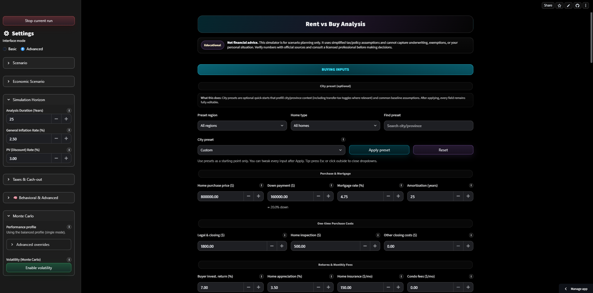
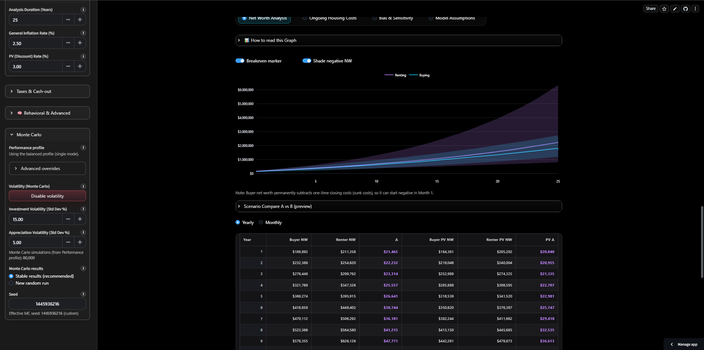
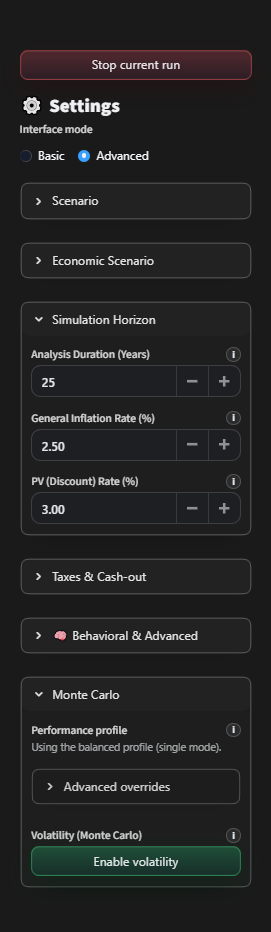

[](https://rent-vs-buy-canada.streamlit.app/)
[](https://www.python.org/downloads/)
[](LICENSE)

# Rent vs Buy Simulator (Canada-focused)

A Streamlit-based **Rent vs Buy** financial simulator with a premium dark fintech UI and both deterministic + Monte Carlo analysis.

> **Disclaimer:** This tool is for educational purposes only and is not financial, tax, or legal advice.

## Key features
- Deterministic and Monte Carlo evaluation of rent vs buy outcomes
- Before-tax and after-tax reporting
- Breakeven solvers (deterministic + volatility-aware)
- Heatmap exploration with selectable comparison axes
- Scenario save/load with stable `st.session_state` keys
- Custom dark tooltip system (avoids Streamlit native help popovers)
- Playwright snapshot harness for UI regression safety
- **Expert mode** hides advanced sensitivity toggles (hypothetical policy + registered shelter approximation)

## Expert mode (advanced toggles)
The **Taxes & Cash-out** panel includes an **Expert mode** switch. When off (default), the app hides advanced sensitivity knobs like hypothetical capital-gains inclusion changes and the registered-shelter approximation, ensuring baseline behavior stays conservative.

## Quick start
### 1) Install
- Python **3.10+** recommended

```bash
pip install -r requirements.txt
```

For reproducible builds (CI / production):
```bash
pip install -r requirements.lock
```

### 2) Run
```bash
streamlit run app.py
```

## Docker

Build and run with Docker:
```bash
docker build -t rbv-simulator .
docker run -p 8501:8501 rbv-simulator
```

Or use Docker Compose:
```bash
docker-compose up
```

Then open http://localhost:8501.

## QA
Run the full QA suite:
```bash
python run_all_qa.py
```

## Preflight (recommended before pushing)
Runs repo sanity checks + QA (and optionally visual smoke snapshots).

```bash
python scripts/preflight.py
# or
make preflight-fast
```

To also run Playwright smoke snapshots:
```bash
python scripts/preflight.py --run-vr-smoke
# or
make preflight
```

## Visual regression snapshots (UI)
This repo includes a lightweight Playwright harness to prevent "fixed → regressed" UI loops.

Install dev deps:
```bash
pip install -r requirements-dev.txt
python -m playwright install --with-deps chromium
```

Update baselines (writes into `tools/visual_regression/baseline/`):
```bash
python tools/visual_regression/vr_playwright.py --update-baseline
```

Compare against baselines:
```bash
python tools/visual_regression/vr_playwright.py
```

Smoke snapshots only (no baseline compare):
```bash
python tools/visual_regression/vr_playwright.py --smoke
```

## Release process
See `docs/RELEASE_CHECKLIST.md` for the full checklist (preflight, baselines, tagging, and GitHub release automation).

## Project layout
- `app.py`: Streamlit UI orchestrator
- `rbv/`: modular core (engine, UI theme, helpers)
- `rbv/qa/` + `run_all_qa.py`: QA gates
- `tools/visual_regression/`: Playwright snapshot harness
- `scripts/preflight.py`: repo sanity + QA checks before pushing


## Screenshots

> **Note:** Screenshots are captured from the live app. To update, run the Playwright snapshot harness:
> `python tools/visual_regression/vr_playwright.py --smoke`

### Main Interface
The dark fintech-themed interface with all core inputs visible:



### Monte Carlo Analysis  
Net worth trajectories with confidence bands from correlated Monte Carlo simulation:



### Sensitivity Heatmap
Dual-axis parameter sweep showing buy vs rent outcomes across different scenarios:


### Sidebar Settings
Advanced configuration including province selection, mortgage parameters, and economic assumptions:



## License
MIT — see `LICENSE`.
